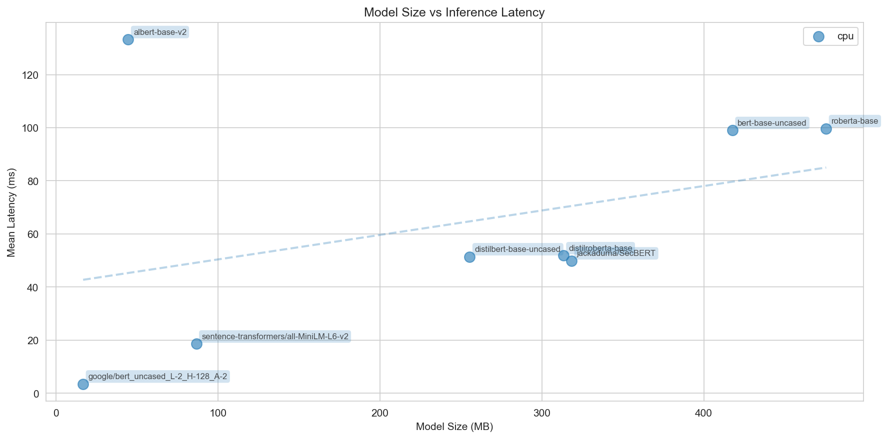
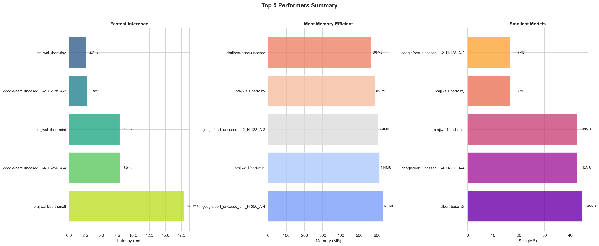

# BERT Model Benchmarking Suite

A comprehensive benchmarking framework for comparing BERT model variants on inference speed, memory efficiency, and model size. Designed for compute-constrained environments and on-premise deployments.

## Overview

This suite helps you:
- **Compare multiple BERT models** - Test distilled, base, and domain-specific variants
- **Measure key metrics** - Latency, throughput, memory usage, model size
- **Test different configurations** - Multiple batch sizes and sequence lengths
- **Support CPU and GPU** - Benchmark on both hardware types
- **Generate reports** - Automated comparison reports and visualizations

**Primary use case**: Finding optimal BERT models for ontology classification with limited compute resources.

## Features

- **Zero-shot benchmarking** - No training data required for initial stats
- **Comprehensive metrics collection**:
  - Inference: mean/median/p95/p99 latency, throughput
  - Memory: peak usage (CPU/GPU)
  - Model: parameter count, size in MB
- **16 model variants** included:
  - Distilled models (DistilBERT, DistilRoBERTa)
  - Tiny BERT variants (4M-29M params)
  - Small Google BERT models (2-6 layers)
  - Domain-specific (SecBERT for cybersecurity)
  - Base models (BERT, RoBERTa)
  - Efficient architectures (ALBERT, DeBERTa)
- **Configurable testing** - Easy YAML configuration for models and benchmark settings
- **Results export** - CSV, JSON, markdown reports, and plots

## What Does This Benchmark Test?

### Performance Metrics (What IS Tested)

This is a **performance and resource benchmark**, NOT an accuracy test. It measures:

✅ **Inference Speed**
- Mean, median, p95, p99 latency (milliseconds)
- How fast can the model process inputs?
- Throughput (samples per second)

✅ **Memory Usage**
- Peak RAM consumption (CPU)
- Peak VRAM consumption (GPU)
- Model size on disk

✅ **Hardware Efficiency**
- CPU/GPU utilization
- Scalability across batch sizes
- Performance across different sequence lengths

### What Is NOT Tested

❌ **Model Accuracy** - Not measuring classification quality
❌ **Prediction Correctness** - Not evaluating output quality
❌ **Real-world Performance** - Not testing on actual OCSF data
❌ **Fine-tuning Quality** - Not measuring learning capability

### How It Works: Dummy Data Testing

The benchmark uses **synthetic/dummy inputs** to test pure performance:

```python
# Example: Dummy text repeated for each batch item
dummy_text = ["cybersecurity threat detection analysis"] * batch_size
```

**Why dummy data?**
1. **No training data required** - Test models before investing in dataset creation
2. **Fair comparison** - All models receive identical inputs
3. **Pure performance** - Measures speed/memory, not prediction quality
4. **Zero-shot baseline** - Identify which models are fast enough for your hardware

**Analogy**: This is like testing cars for acceleration and fuel efficiency on a test track. You're not testing if it can navigate to your destination - you're testing if it's *fast enough and efficient enough* to be worth considering.

### Testing Loop

For each model and configuration:

```
1. Load model → measure size
2. Create dummy inputs (tokenized text)
3. Warmup (10 runs) → stabilize GPU/CPU
4. Measure (100 runs) → record latency, memory
5. Calculate statistics → mean, p95, p99, throughput
6. Generate report → compare all models
```

### When You Have Real Data

Once you have labeled cybersecurity -> ontology mappings, you can extend this framework to test:
- **Training speed** - Time to fine-tune models
- **Classification accuracy** - Precision, recall, F1 score
- **Real inference quality** - Performance on actual cybersecurity data

See [Next Steps](#next-steps) for guidance on adding accuracy benchmarks.

## Table of Contents

- [BERT Model Benchmarking Suite](#bert-model-benchmarking-suite)
  - [Overview](#overview)
  - [Features](#features)
  - [What Does This Benchmark Test?](#what-does-this-benchmark-test)
    - [Performance Metrics (What IS Tested)](#performance-metrics-what-is-tested)
    - [What Is NOT Tested](#what-is-not-tested)
    - [How It Works: Dummy Data Testing](#how-it-works-dummy-data-testing)
    - [Testing Loop](#testing-loop)
    - [When You Have Real Data](#when-you-have-real-data)
  - [Table of Contents](#table-of-contents)
  - [Installation](#installation)
    - [1. Set up Python Virtual Environment](#1-set-up-python-virtual-environment)
    - [2. Install PyTorch 2.6+](#2-install-pytorch-26)
    - [3. Install Other Dependencies](#3-install-other-dependencies)
    - [4. Configure Cache Location](#4-configure-cache-location)
      - [Cache Directory Precedence](#cache-directory-precedence)
    - [5. Verify Installation](#5-verify-installation)
    - [Deactivating Virtual Environment](#deactivating-virtual-environment)
  - [Quick Start](#quick-start)
    - [1. Run a fast benchmark (recommended first run)](#1-run-a-fast-benchmark-recommended-first-run)
    - [2. Run full benchmark](#2-run-full-benchmark)
    - [3. Test specific models](#3-test-specific-models)
    - [4. CPU-only testing](#4-cpu-only-testing)
  - [Command-Line Options](#command-line-options)
    - [`--models MODEL1 MODEL2 ...`](#--models-model1-model2-)
    - [`--devices DEVICE1 DEVICE2 ...`](#--devices-device1-device2-)
    - [`--fast`](#--fast)
    - [`--no-plots`](#--no-plots)
    - [`--output-dir DIRECTORY`](#--output-dir-directory)
    - [`--force-cache-dir`](#--force-cache-dir)
    - [Combining Options](#combining-options)
    - [Getting Help](#getting-help)
  - [Configuration](#configuration)
    - [Models Configuration (`configs/models.yaml`)](#models-configuration-configsmodelsyaml)
    - [Benchmark Configuration (`configs/benchmark_config.yaml`)](#benchmark-configuration-configsbenchmark_configyaml)
  - [Results](#results)
    - [Automatic Generation](#automatic-generation)
    - [Directory Structure](#directory-structure)
    - [Generated Files](#generated-files)
    - [Terminal Output Example](#terminal-output-example)
    - [Regenerating Reports](#regenerating-reports)
  - [Use Cases](#use-cases)
    - [1. Initial Model Selection (No Training Data)](#1-initial-model-selection-no-training-data)
    - [2. On-Premise Deployment Planning](#2-on-premise-deployment-planning)
    - [3. Comparing Domain-Specific Models](#3-comparing-domain-specific-models)
    - [4. Scaling Analysis](#4-scaling-analysis)
  - [Project Structure](#project-structure)
  - [Programmatic Usage](#programmatic-usage)
  - [Next Steps](#next-steps)
    - [When you have training data:](#when-you-have-training-data)
    - [For production deployment:](#for-production-deployment)
  - [Tips for Compute-Constrained Environments](#tips-for-compute-constrained-environments)
  - [Troubleshooting](#troubleshooting)
    - [Long Pause After Model Loads (PyTorch 2.5+)](#long-pause-after-model-loads-pytorch-25)
    - [Protobuf / Module Import Errors](#protobuf--module-import-errors)
    - [CUDA out of memory](#cuda-out-of-memory)
    - [Model download fails](#model-download-fails)
    - [Slow benchmarking](#slow-benchmarking)
    - [Models downloading to wrong location](#models-downloading-to-wrong-location)
  - [License](#license)
  - [Authors](#authors)
  - [Future Enhancements](#future-enhancements)
  - [Contributing](#contributing)

## Installation

### 1. Set up Python Virtual Environment

It's recommended to use a virtual environment to isolate dependencies.

**On Windows:**
```bash
# Navigate to the project directory
cd \path\to\bert_benchmarking

# Create virtual environment
python -m venv venv

# Activate virtual environment
venv\Scripts\activate
```

**On Linux/Mac:**
```bash
# Navigate to the project directory
cd /path/to/bert_benchmarking

# Create virtual environment
python3 -m venv venv

# Activate virtual environment
source venv/bin/activate
```

You should see `(venv)` in your terminal prompt when activated.

### 2. Install PyTorch 2.6+

**Required: PyTorch 2.6+ stable** (fixes CVE-2025-32434 and enables all 16 models)

**Windows Users - Just Run This:**
```bash
fix_pytorch.bat
```

The script automatically handles everything: uninstalls old PyTorch, upgrades NumPy, installs latest stable PyTorch (2.9.1+cu126), and verifies installation.

**Linux/Mac Users:**
```bash
# For CUDA 12.6 (RTX 40xx series, newest)
pip install torch torchvision torchaudio --index-url https://download.pytorch.org/whl/cu126

# For CUDA 12.4 (RTX 30xx/40xx series)
pip install torch torchvision torchaudio --index-url https://download.pytorch.org/whl/cu124

# For CUDA 11.8 (older GPUs)
pip install torch torchvision torchaudio --index-url https://download.pytorch.org/whl/cu118

# For CPU only
pip install torch torchvision torchaudio --index-url https://download.pytorch.org/whl/cpu
```

**Why PyTorch 2.6+?** Stable releases 2.6.0 and later include:
- ✅ CVE-2025-32434 security fix
- ✅ Support for all model formats (enables all 16 models including pickle-based)
- ✅ NumPy 1.x and 2.x compatibility

**Important:** Dev/nightly builds from before the stable 2.6.0 release (like 2.6.0.dev20241112) will NOT work. You need stable 2.6.0 or later.

**Need help?** See [UPGRADE_PYTORCH.md](UPGRADE_PYTORCH.md) for detailed information and troubleshooting.

### 3. Install Other Dependencies

```bash
pip install -r requirements.txt
```

### 4. Configure Cache Location

**IMPORTANT**: BERT models will download 10-50GB of data. Choose where to store them.

**Option A: Interactive setup (recommended)**
```bash
python setup_cache.py
```

This script will:
- Scan your available drives and show free space
- Suggest the best location
- Create a `.env` file with your choice

**Option B: Manual setup**
```bash
# Copy the example file
cp .env.example .env

# Edit .env and set your cache directory
# Example for Windows: BERT_CACHE_DIR=D:\bert_cache
# Example for Linux: BERT_CACHE_DIR=/mnt/data/bert_cache
```

**Important notes:**
- Don't use OneDrive/Dropbox/Google Drive folders (will try to sync GBs)
- Ensure 20-50GB free space on the chosen drive
- Use forward slashes `/` or double backslashes `\\` on Windows

#### Cache Directory Precedence

The framework respects the following precedence order (highest to lowest):

1. **System environment variables** - If you have `HF_HOME`, `HF_HUB_CACHE`, etc. set in your system, they will be respected
2. **`.env` file** - If system variables aren't set, uses `BERT_CACHE_DIR` from `.env`
3. **Default** - Falls back to `./cache` in project directory

**If you have system environment variables set and want to override them:**
```bash
python run_benchmark.py --force-cache-dir --fast
```

The `--force-cache-dir` flag ignores system environment variables and uses the `.env` configuration instead.

**To check which cache location will be used:**
```bash
python run_benchmark.py --fast
# Look for "Cache Configuration:" at the start of output
```

### 5. Verify Installation

**Recommended: Run verification script**
```bash
python verify_setup.py
```

This script checks all dependencies and diagnoses common issues. If all checks pass, you're ready to run benchmarks!

**Manual verification:**
```bash
# Check PyTorch and CUDA
python -c "import torch; print(f'PyTorch: {torch.__version__}'); print(f'CUDA: {torch.cuda.is_available()}'); print(f'GPU: {torch.cuda.get_device_name(0) if torch.cuda.is_available() else \"N/A\"}')"

# Expected output with GPU:
# PyTorch: 2.9.1+cu126 (or similar)
# CUDA: True
# GPU: NVIDIA GeForce RTX 3080
```

**If verification fails**, see the [Troubleshooting](#troubleshooting) section.

### Deactivating Virtual Environment

When you're done working:
```bash
deactivate
```

## Quick Start

**Note**: On first run, models will download to your configured cache directory (can take 5-15 minutes depending on your internet connection).

### 1. Run a fast benchmark (recommended first run)

```bash
# Fast benchmark with reduced iterations
python run_benchmark.py --fast
```

This runs a fast benchmark on all configured models with:
- Fewer iterations (20 vs 100)
- Limited batch sizes (1, 8)
- Limited sequence lengths (64, 128)
- Models will be downloaded to your cache directory (see `.env` file)

### 2. Run full benchmark

```bash
# Full benchmark on all models
python run_benchmark.py
```

### 3. Test specific models

```bash
# Only test specific models
python run_benchmark.py --models distilbert-base-uncased prajjwal1/bert-tiny
```

### 4. CPU-only testing

```bash
# Test on CPU only (for on-prem without GPU)
python run_benchmark.py --devices cpu
```

## Command-Line Options

The `run_benchmark.py` script supports the following command-line flags:

### `--models MODEL1 MODEL2 ...`

Specify which models to benchmark. Accepts one or more model names.

**Default**: All models defined in `configs/models.yaml`

**Examples:**
```bash
# Test single model
python run_benchmark.py --models distilbert-base-uncased

# Test multiple specific models
python run_benchmark.py --models distilbert-base-uncased bert-base-uncased

# Test tiny models for speed
python run_benchmark.py --models prajjwal1/bert-tiny prajjwal1/bert-mini
```

### `--devices DEVICE1 DEVICE2 ...`

Specify which device(s) to run benchmarks on.

**Options**: `cpu`, `cuda`

**Default**: From `configs/benchmark_config.yaml` (both if available)

**Examples:**
```bash
# CPU only
python run_benchmark.py --devices cpu

# GPU only
python run_benchmark.py --devices cuda

# Test on both (explicit)
python run_benchmark.py --devices cpu cuda
```

### `--fast`

Run a fast benchmark with reduced iterations and configurations.

**Default**: Full benchmark

**Fast mode settings:**
- Warmup iterations: 5 (vs 10)
- Test iterations: 20 (vs 100)
- Batch sizes: [1, 8] (vs [1, 4, 8, 16, 32])
- Sequence lengths: [64, 128] (vs [32, 64, 128, 256])
- Results folder: `YYYYMMDD_HHMMSS_fast` (vs `_full`)

**Examples:**
```bash
# Fast benchmark
python run_benchmark.py --fast

# Fast benchmark on specific models
python run_benchmark.py --fast --models distilbert-base-uncased

# Fast benchmark, CPU only
python run_benchmark.py --fast --devices cpu
```

**Use when**: Testing setup, rapid iteration, or limited compute time.

### `--no-plots`

Skip generating visualization plots. Only CSV, JSON, and markdown report will be generated.

**Default**: Plots are generated

**Examples:**
```bash
# Skip plots
python run_benchmark.py --no-plots

# Fast benchmark without plots
python run_benchmark.py --fast --no-plots
```

**Use when**: Running on headless servers, saving time, or only need raw data.

### `--output-dir DIRECTORY`

Specify custom output directory for results.

**Default**: `results`

**Examples:**
```bash
# Custom output directory
python run_benchmark.py --output-dir my_experiments

# Save to absolute path
python run_benchmark.py --output-dir /data/benchmarks

# Windows path
python run_benchmark.py --output-dir D:\experiments
```

**Note**: Timestamped subdirectories are still created within this directory.

### `--force-cache-dir`

Force use of `BERT_CACHE_DIR` from `.env` file, overriding system environment variables.

**Default**: Respects system environment variables

**Examples:**
```bash
# Force .env cache location
python run_benchmark.py --force-cache-dir --fast

# Ignore system HF_HOME and use .env
python run_benchmark.py --force-cache-dir --models distilbert-base-uncased
```

**Use when**:
- System environment variables point to wrong location
- Want to ensure specific cache directory is used
- Troubleshooting cache location issues

**See**: [Cache Directory Precedence](#cache-directory-precedence) for details.

### Combining Options

All options can be combined:

```bash
# Fast CPU-only benchmark, specific models, custom output, forced cache
python run_benchmark.py \
  --fast \
  --devices cpu \
  --models distilbert-base-uncased prajjwal1/bert-tiny \
  --output-dir fast_cpu_test \
  --force-cache-dir
```

### Getting Help

View all options:
```bash
python run_benchmark.py --help
```

## Configuration

### Models Configuration (`configs/models.yaml`)

Add or remove models to test:

```yaml
models:
  - name: "distilbert-base-uncased"
    type: "sequence-classification"
    description: "40% smaller, 60% faster than BERT-base"

  - name: "jackaduma/SecBERT"
    type: "sequence-classification"
    description: "Pre-trained on cybersecurity corpus"
```

**Pre-configured models include** (16 models total):

**Distilled models:**
- `distilbert-base-uncased` - Distilled BERT (66M params)
- `distilroberta-base` - Distilled RoBERTa (82M params)

**Tiny/Small models** (requires PyTorch 2.6+):
- `prajjwal1/bert-tiny` - Tiny BERT (4M params)
- `prajjwal1/bert-mini` - Mini BERT (11M params)
- `prajjwal1/bert-small` - Small BERT (29M params)
- `google/bert_uncased_L-2_H-128_A-2` - Ultra-tiny (2 layers)
- `google/bert_uncased_L-4_H-256_A-4` - Small (4 layers)
- `google/bert_uncased_L-6_H-512_A-8` - Medium (6 layers)

**Domain-specific:**
- `jackaduma/SecBERT` - Cybersecurity BERT

**Base models:**
- `bert-base-uncased` - Original BERT (110M params)
- `roberta-base` - RoBERTa (125M params)

**Efficient architectures**:
- `albert-base-v2` - ALBERT with parameter sharing (12M params)

**Microsoft architectures** (requires PyTorch 2.6+):
- `microsoft/deberta-v3-small` - DeBERTaV3 small
- `microsoft/deberta-v3-base` - DeBERTaV3 base (86M params)

**Sentence embeddings:**
- `sentence-transformers/all-MiniLM-L6-v2` - Fast semantic search (23M params)

**Important**: Some of these models require **PyTorch 2.6+** due to legacy pickle format. With older PyTorch versions, only 8 models are guaranteed to work. See [UPGRADE_PYTORCH.md](UPGRADE_PYTORCH.md) for upgrade instructions.

### Benchmark Configuration (`configs/benchmark_config.yaml`)

Customize test parameters:

```yaml
benchmark:
  warmup_iterations: 10
  test_iterations: 100
  batch_sizes: [1, 4, 8, 16, 32]
  sequence_lengths: [32, 64, 128, 256]
  devices: ["cpu", "cuda"]
  num_classes: 10  # Update as ontology grows
```

## Results

### Automatic Generation

When you run a benchmark, **all results are automatically generated** including:
- Raw data (CSV + JSON)
- Comparison report (Markdown)
- Comparison plots (4 PNG images showing latency, throughput, memory, size vs latency)
- Top performers plots (4 PNG images showing top 5 fastest, most memory efficient, smallest, and combined summary)

No additional commands needed! The top performers plots provide visual bar charts that make it easy to see at-a-glance which models are best in each category.

### Directory Structure

Results are organized in timestamped subdirectories with benchmark type indicators:

```
results/
├── 20251111_101910_fast/     # Timestamp: YYYYMMDD_HHMMSS_type
│   ├── benchmark_results.csv          # Raw data (all metrics)
│   ├── benchmark_results.json         # Structured data
│   ├── benchmark_report.md            # Summary report
│   ├── plots_latency.png              # Latency comparison
│   ├── plots_throughput.png           # Throughput comparison
│   ├── plots_memory.png               # Memory usage comparison
│   ├── plots_size_vs_latency.png      # Size vs speed tradeoff
│   ├── top_performers_fastest.png     # Top 5 fastest models
│   ├── top_performers_memory.png      # Top 5 memory efficient
│   ├── top_performers_smallest.png    # Top 5 smallest models
│   └── top_performers_summary.png     # Combined top 3 summary
├── 20251111_143022_full/     # Full benchmark run
│   └── ...
└── 20251111_180515_fast/     # Another fast run
    └── ...
```

**Folder naming convention**: `YYYYMMDD_HHMMSS_type`
- `_fast` = Fast benchmark (`--fast` flag)
- `_full` = Full benchmark (default)

**Each run gets its own directory**, making it easy to:
- Compare different benchmark runs
- Distinguish between fast tests and full benchmarks
- Track performance over time
- Keep experimental configurations separate

### Generated Files

**benchmark_results.csv / .json**
- All raw metrics for every model tested
- Includes batch size and sequence length variations
- Perfect for custom analysis in Excel, Python, etc.

**benchmark_report.md**
- Summary statistics grouped by model and device
- Best performers (fastest CPU/GPU, smallest, most memory efficient)
- Human-readable markdown format

**Comparison plots (plots_*.png)**
- `plots_latency.png` - Inference latency by model
- `plots_throughput.png` - Samples per second
- `plots_memory.png` - Peak memory usage
- `plots_size_vs_latency.png` - Model size vs speed tradeoff

**Top performers plots (top_performers_*.png)**
- `top_performers_fastest.png` - Top 5 fastest models (bar chart)
- `top_performers_memory.png` - Top 5 most memory efficient (bar chart)
- `top_performers_smallest.png` - Top 5 smallest models (bar chart)
- `top_performers_summary.png` - Combined 3-panel summary of top 3 in each category

**Example output images:**




### Terminal Output Example

```
TOP PERFORMERS

Fastest inference (by latency):
                                    mean_latency_ms  model_size_mb  num_parameters
model_name
distilbert-base-uncased                       8.45          255.89       66362882
prajjwal1/bert-tiny                           4.12           17.45        4385920
sentence-transformers/all-MiniLM-L6-v2        6.78           80.45       22713088

Most memory efficient:
                                    peak_memory_mb  model_size_mb  num_parameters
model_name
prajjwal1/bert-tiny                         145.32           17.45        4385920
prajjwal1/bert-mini                         178.56           42.67       11171072
```

### Regenerating Reports

If a benchmark completes but report generation fails, you can regenerate:

```bash
python generate_report.py results/20251111_101910_fast/benchmark_results.json
```

This creates the report and plots without re-running the benchmark.

## Use Cases

### 1. Initial Model Selection (No Training Data)

Run benchmarks to identify top candidates before investing in dataset creation:

```bash
python run_benchmark.py --fast
```

Review results to find models with best speed/memory tradeoff.

### 2. On-Premise Deployment Planning

Test on actual hardware:

```bash
# If you have GPU access
python run_benchmark.py --devices cuda

# CPU-only environment
python run_benchmark.py --devices cpu
```

### 3. Comparing Domain-Specific Models

Focus on cybersecurity-specific models:

```bash
python run_benchmark.py --models "jackaduma/SecBERT" bert-base-uncased
```

### 4. Scaling Analysis

Test how models handle different batch sizes:

- Edit `configs/benchmark_config.yaml` to adjust batch sizes
- Run full benchmark
- Analyze throughput scaling

## Project Structure

```
bert_benchmarking/
├── configs/
│   ├── models.yaml              # Model definitions
│   └── benchmark_config.yaml    # Benchmark settings
├── src/
│   ├── __init__.py
│   ├── benchmarker.py           # Main benchmarking orchestrator
│   ├── metrics.py               # Metrics collection (speed, memory)
│   └── results.py               # Results storage and visualization
├── results/                     # Timestamped output directories (auto-created)
│   ├── 20251111_101910_fast/    # Each run: YYYYMMDD_HHMMSS_type
│   │   ├── benchmark_results.csv
│   │   ├── benchmark_results.json
│   │   ├── benchmark_report.md
│   │   └── plots_*.png
│   └── 20251111_143022_full/
│       └── ...
├── run_benchmark.py             # Main entry point
├── generate_report.py           # Regenerate reports from saved results
├── setup_cache.py               # Interactive cache configuration
├── verify_setup.py              # Verify installation and diagnose issues
├── fix_pytorch.bat              # Install PyTorch 2.9.1+cu126 (Windows)
├── requirements.txt
├── .env.example                 # Template for cache configuration
├── LICENSE                      # MIT License
├── README.md
├── QUICKSTART.md
└── UPGRADE_PYTORCH.md           # PyTorch 2.6+ upgrade guide
```

## Programmatic Usage

You can also use the framework programmatically:

```python
from src import BERTBenchmarker, ResultsManager

# Initialize
benchmarker = BERTBenchmarker()

# Run benchmark
results = benchmarker.run_benchmark(
    models_subset=["distilbert-base-uncased"],
    devices_subset=["cpu"]
)

# Analyze results
results_manager = ResultsManager()
results_manager.save_results(results)
results_manager.create_comparison_plots(results)

# Get best models
best = results_manager.get_best_models(
    results,
    criterion="latency",
    top_k=5
)
print(best)
```

## Next Steps

### When you have training data:

1. **Add fine-tuning capability** - Extend `benchmarker.py` to support training
2. **Track training metrics** - Add training time, convergence to metrics
3. **Test on real data** - Replace dummy inputs with actual OCSF samples
4. **Evaluate accuracy** - Add classification quality metrics

### For production deployment:

1. **Quantization** - Test INT8/FP16 quantized models
2. **ONNX export** - Convert best models to ONNX for faster inference
3. **Batch optimization** - Find optimal batch size for your workload
4. **Load testing** - Simulate production traffic patterns

## Tips for Compute-Constrained Environments

1. **Start with distilled models** - 2-6x faster with minimal accuracy loss
2. **Test tiny variants first** - `prajjwal1/bert-tiny` (4M params) is extremely fast
3. **Focus on CPU performance** - Many on-prem environments lack GPU
4. **Batch size = 1 for real-time** - Test latency at batch_size=1 for streaming data
5. **Consider sentence-transformers** - Optimized for fast semantic similarity
6. **Progressive sizing** - Test tiny → mini → small → base to find the sweet spot

## Troubleshooting

### Long Pause After Model Loads (PyTorch 2.5+)

**Symptom**: After "Loading model..." there's a 5-30 second pause before benchmarking starts.

**This is normal!** PyTorch 2.5+ compiles models on first use for optimization:
- The pause is JIT compilation happening in the background
- This only happens once per model when loaded
- The warmup phase absorbs this compilation time
- Your benchmark results are NOT affected - measurements happen after warmup

**Example:**
```
Loading bert-base-uncased...
✓ Loaded successfully
[pause 10-20 seconds - compilation]
Warmup (10 iterations)...  ← Compilation happens here
Testing (100 iterations)... ← Real measurements start here
```

**No action needed** - this is expected behavior and ensures optimal inference performance.

### Protobuf / Module Import Errors

If you see errors like "requires the protobuf library but it was not found" or other import errors:

**Solution 1: Reinstall dependencies**
```bash
pip install --upgrade -r requirements.txt
```

**Solution 2: Restart your Python session**
After installing new packages (especially protobuf), you may need to:
- Close your terminal/command prompt completely
- Reopen and reactivate your virtual environment
- Run the benchmark again

**Solution 3: Install specific packages**
```bash
# Install protobuf explicitly
pip install protobuf>=3.20.0

# For some models (ALBERT, T5-based), install sentencepiece
pip install sentencepiece>=0.1.99

# Then restart your Python session
```

**Why this happens**: Some models (especially ALBERT, SecBERT) require additional dependencies that must be loaded before the model can initialize. Python needs to be restarted after installing these packages.

### CUDA out of memory
- Reduce batch sizes in config
- Test smaller models first
- Use `--devices cpu` for CPU-only testing

### Model download fails
- Check internet connection
- Some models may not be available (will skip automatically)
- Verify model names in Hugging Face hub

### Slow benchmarking
- Use `--fast` flag for faster testing
- Reduce number of models in config
- Test on specific models: `--models distilbert-base-uncased`

### Models downloading to wrong location
If models are downloading to an unexpected directory:

1. **Check which cache is being used:**
   ```bash
   python run_benchmark.py --fast
   # Look at "Cache Configuration:" output
   ```

2. **System environment variables may be overriding .env:**
   - Check Windows Environment Variables (search "Environment Variables" in Start Menu)
   - Look for `HF_HOME`, `HF_HUB_CACHE`, `TRANSFORMERS_CACHE`
   - Either remove them or use `--force-cache-dir` flag

3. **Force use of .env configuration:**
   ```bash
   python run_benchmark.py --force-cache-dir --fast
   ```

4. **Verify .env file:**
   ```bash
   cat .env  # Linux/Mac
   type .env  # Windows
   ```

**Remember:** System environment variables take precedence over `.env` by default (this is standard practice and respects user configuration).

## License

MIT License - Copyright (c) 2025 Tyler T. Procko

This project is licensed under the MIT License - see the [LICENSE](LICENSE) file for full details.

You are free to use, modify, and distribute this software for any purpose, including commercial applications.

## Authors

**Primary Author**: Claude (Anthropic)
- Framework architecture and implementation
- Benchmarking infrastructure
- Documentation and examples

**Project Owner**: Tyler T. Procko
- Project requirements and direction
- Testing and validation
- Copyright holder

This project was developed through collaborative AI-assisted software engineering, combining domain expertise with AI capabilities to create a practical benchmarking tool for compute-constrained environments.

## Future Enhancements

- [ ] Add fine-tuning benchmarks
- [ ] Support for multi-label classification
- [ ] Quantization (INT8, FP16) testing
- [ ] ONNX runtime comparison
- [ ] Ontology relationship handling
- [ ] Real cybersecurity data integration
- [ ] Streaming inference simulation

## Contributing

To add new models, edit `configs/models.yaml`:

```yaml
- name: "your-model-name"
  type: "sequence-classification"
  description: "Model description"
```

Then run the benchmark!
